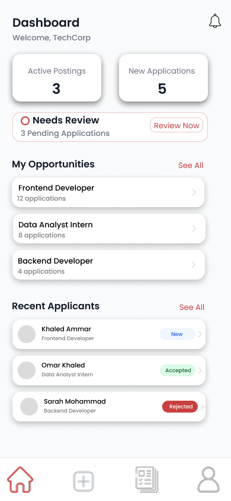
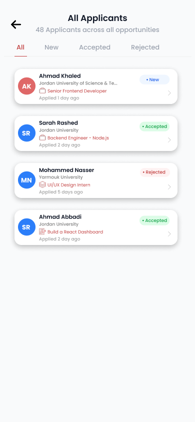
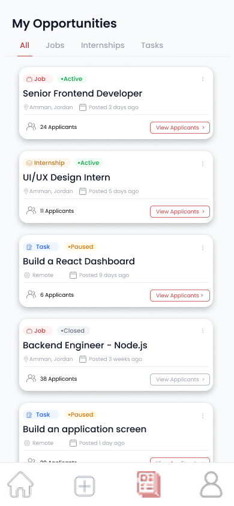

# ITConnect

ITConnect is a student opportunity platform that connects students with companies offering internships, jobs, tasks, and skill-building opportunities.

## Project overview

ITConnect was developed as my Computer Science graduation project at Applied Science Private University.

The platform provides separate experiences for students and companies, bringing opportunity discovery, applications, profiles, notifications, and company opportunity management into one mobile application.

## My role

I worked as part of a three-person team and contributed to both the UI/UX design and Flutter application development.

My responsibilities included:

- Designing student and company interfaces
- Developing Flutter mobile screens
- Implementing authentication and role-selection flows
- Building student and company profile experiences
- Creating opportunity discovery interfaces
- Implementing level-based opportunities
- Developing job and internship application flows
- Building company opportunity creation and management screens
- Connecting the application to Firebase
- Working with authentication, database data, storage, and notifications
- Testing relationships between users, opportunities, applications, and related data

## Timeline and team

- Timeline: November 2025 – June 2026
- Project type: Computer Science Graduation Project
- Team: 3 people
- University: Applied Science Private University

## Problem

Students often need to search across different sources to find internships, jobs, tasks, and opportunities that match their education level and skills.

Companies also need a structured way to publish opportunities and review suitable student applications.

ITConnect addresses both needs through one platform designed for students and companies.

## Main features

- Student and company accounts
- Authentication and role selection
- Student profiles
- Company profiles
- CV upload
- Internship and job discovery
- Level-based opportunities
- Task opportunities
- Job and internship applications
- Company opportunity creation
- Application management
- Notifications
- Profile management
- Ratings and feedback

## Process

The project began by identifying the two main users: students and companies.

We mapped the workflows required for each role, including:

- Student registration and authentication
- Student profile and CV management
- Browsing and discovering opportunities
- Viewing level-based opportunities
- Applying for opportunities
- Company registration and profile management
- Creating and managing opportunities
- Reviewing applications
- Notifications and interactions between users

The interfaces and workflows were refined throughout development as features were implemented and tested.

Firebase integration was tested across authentication, data storage, data retrieval, and the relationships between users, opportunities, applications, notifications, and other platform data.

## Selected screens

### Company home dashboard

A company-side dashboard for reviewing opportunities, applications, and recent activity.

### Applicants screen

An interface for companies to review applicants and their application information.

### Company applications

A company-side view for managing applications connected to published opportunities.

## Specific deliverables

My development work included:

- Flutter mobile screens for student and company users
- Student and company authentication flows
- Student and company profiles
- CV upload functionality
- Opportunity exploration and discovery
- Level-based opportunity experiences
- Application workflows
- Company opportunity creation
- Company opportunity management
- Firebase Authentication integration
- Firebase Realtime Database integration
- Firebase Storage integration
- Notifications and supporting data flows

## Technologies

- Flutter
- Dart
- Firebase Authentication
- Firebase Realtime Database
- Firebase Storage
- Figma
- Git
- GitHub

## Biggest challenge

One of the main challenges was connecting the different parts of the application to Firebase while maintaining correct relationships between users, opportunities, applications, and notifications.

Authentication, database paths, Firebase configuration, and data retrieval required careful testing and troubleshooting across both student and company experiences.

## Outcome

ITConnect was delivered as a working mobile application that connects students with companies and career opportunities.

The project demonstrated a complete multi-role application experience combining:

- UI/UX design
- Flutter mobile development
- Authentication
- Firebase integration
- Data management
- Application workflows
- Student-company interaction

## Project availability

This repository is a case-study and design repository.

The source code is kept private because the original project repository contains the Flutter implementation.

The project was developed as a university graduation project and is not currently available as a publicly deployed application.
